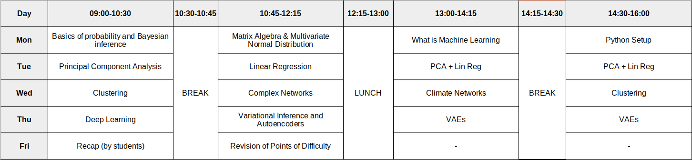

# seminar_ws22

This is the repository for the seminar from 21.03.22 - 25.03.22.

More information about the seminar can be found on our [website](https://machineclimate.de/teaching/winter2021-22-ml1/)

The planned schedule:


## Installation

Due to dependencies we recommend using conda. We provided a list of packages in the 
'condaEnv.yml' file. The following steps set up a new environment with all required packages:
1. Install packages: 
```
conda env create -f condaEnv.yml
```
2. Activate environment:
```
conda activate seminarEnv
```

*Note: If you don't have a grafic card you can comment the line including cudatoolkit in the condaenv.yml file* 